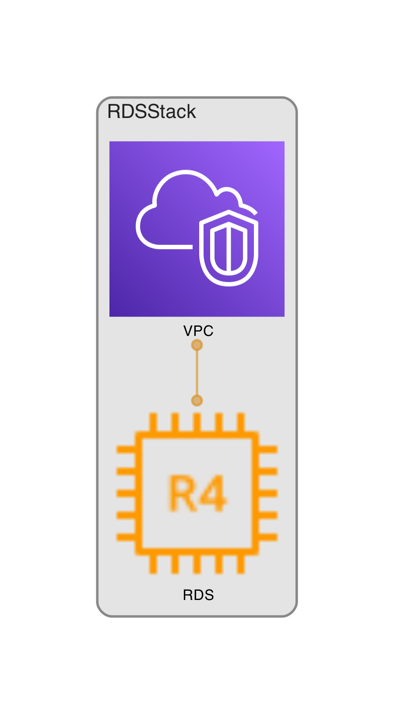

# Prerequisites

### AWS CDK

Install the AWS CDK Toolkit globally using the following Node Package Manager command

```
npm install -g aws-cdk
```

create and activate virtual env

```
python3 -m venv .venv
source .venv/bin/activate
```

install python dependancies

```
pip install -r ./requirements.txt
```

requirements.txt

```
aws-cdk-lib>=2.0.0
constructs>=10.0.0
```


### Terraform

First, install the HashiCorp tap, a repository of all our Homebrew packages.

```
brew tap hashicorp/tap
```

Now, install Terraform with hashicorp/tap/terraform.

```
brew install hashicorp/tap/terraform
```

Enable tab completion

```
touch ~/.zshrc
terraform -install-autocomplete
```


# Create and Deploy Relational Database Service (Postgres)

### AWS CDK

2 files are required:

1. cdk.json that holds instruction for toolkit with language and main initial file

```json
{
  "app": "python3 app.py"
}
```

2. app.py which we have pointed in cdk.json. cdk.json name can not be changed but app.py is full custom and determine
   inside cdk.json

```python

# Import specific constructs groups from aws_cdk according to our needs
from aws_cdk import (
    aws_ec2 as ec2,
    aws_rds as rds,
    App, RemovalPolicy, Stack
)


# Create class inheriting from Stack to make it possible to transform whole class to aws template (at the end of code)
class RDSStack(Stack):
    def __init__(self, app: App, id: str, **kwargs) -> None:
        super().__init__(app, id, **kwargs)

        # Create Virtual Private Cloud to contain database
        # as parameters for every construct we use self and specific name of object (sometimes called id)
        vpc = ec2.Vpc(self, "VPC")

        # Create RDS DatabaseInstance construct and define all variables inside. Pycharm will suggest
        # parameters and conduct code verification as aws_cdk is python library

        rds.DatabaseInstance(
            self, "RDS",
            database_name="db1",
            engine=rds.DatabaseInstanceEngine.postgres(
                version=rds.PostgresEngineVersion.VER_12_3
            ),

            # point previously created vpc to assure connection (RDS cluster will be part of VPC)
            # if left empty the liblary will create new, default VPC
            vpc=vpc,
            port=5432,

            # Determine class and size of database cluster check for details:
            # https://aws.amazon.com/ec2/instance-types/
            instance_type=ec2.InstanceType.of(
                ec2.InstanceClass.MEMORY4,
                ec2.InstanceSize.LARGE,
            ),

            # determine what will happen when command to destroy the stack in this case we make it possible
            # to destroy database alongside with the rest of stack (strongly not recommended for production !)
            removal_policy=RemovalPolicy.DESTROY,
            deletion_protection=False
        ),


# point the highest order structure with App()
app = App()

# Place the construct we have created RDSStack as a part of app
RDSStack(app, "RDSStack")

# Appoint function creating CloudFormation templates from our construct
app.synth()
```

3. (optional) to create CloudFormation templates that will build the stack on aws:

```
cdk synth
```

this step is not required as the templates will be created with command `cdk deploy` as well however creating templates
locally as separate process will make it possible to create infrastructure diagram

4. (optional) create infrastructure diagram with cdk-dia

Prerequisites:

```
npm install cdk-dia -g
brew install graphviz
```

assure there are no spaces in the path (names of any folder) as it will crush cdk-dia

example of diagram generated by upper mentioned code:



5. bootstrap

beside templates, we have pass additional files (photos, dockerfiles etc if used in our code) as well as cdk toolkit
itself to the stack. To pass that files to aws stack and temp bucket we use `cdk boostrap`

the first usage of `cdk bootstrap` requre to pass additional arguments where we specify our aws id and region. We can
use this snippet to invoke both parameters automatically

```
ACCOUNT_ID=$(aws sts get-caller-identity --query Account | tr -d '"')
AWS_REGION=$(aws configure get region)
cdk bootstrap aws://${ACCOUNT_ID}/${AWS_REGION}
```

after first usage of boostrap with these parameters we can use just `cdk boostrap` and the parameters will be hold in
stack

6. deploy

finally we can deploy our templates with command:

```
cdk deploy
```

this will generate CloutFormation templates, fill in gaps (there we have left no parameters if allowed) with defaults,
appoint main constructs to stack outputs etc and deploy all togather to aws stack

7. update code do aws

we can use very same

```
cdk deploy
```

or instead we can use `cdk deploy --hotswap` to radically speedup deployments for updated. In this case the CDK CLI will
try to use AWS service APIs to directly make the changes, otherwise it will fall back to performing a full
CloudFormation deployment. This method is not recommended for production.

### Terraform

terraform require set of 8 files which make it already more complicate than cdk

1. main.tf

```terraform
terraform {
  required_version = ">= 0.12"
}

provider "aws" {
  region = var.aws_region
}

resource "aws_db_instance" "default" {
  depends_on             = [aws_security_group.default]
  identifier             = var.identifier
  allocated_storage      = var.storage
  engine                 = var.engine
  engine_version         = var.engine_version[var.engine]
  instance_class         = var.instance_class
  name                   = var.db_name
  username               = var.username
  password               = var.password
  vpc_security_group_ids = [aws_security_group.default.id]
  db_subnet_group_name   = aws_db_subnet_group.default.id
}

resource "aws_db_subnet_group" "default" {
  name        = "main_subnet_group"
  description = "Our main group of subnets"
  subnet_ids  = [aws_subnet.subnet_1.id, aws_subnet.subnet_2.id]
}
```

2. variables.tf

```terraform
variable "aws_region" {
  default = "us-west-2"
}

variable "identifier" {
  default     = "mydb-rds"
  description = "Identifier for your DB"
}

variable "storage" {
  default     = "10"
  description = "Storage size in GB"
}

variable "engine" {
  default     = "postgres"
  description = "Engine type, example values mysql, postgres"
}

variable "engine_version" {
  description = "Engine version"

  default = {
    mysql    = "5.7.21"
    postgres = "9.6.8"
  }
}

variable "instance_class" {
  default     = "db.t2.micro"
  description = "Instance class"
}

variable "db_name" {
  default     = "mydb"
  description = "db name"
}

variable "username" {
  default     = "myuser"
  description = "User name"
}

variable "password" {
  description = "password, provide through your ENV variables"
}
```

3. sg.tf that provide constructs for `aws_security_group`

```terraform
resource "aws_security_group" "default" {
  name        = "main_rds_sg"
  description = "Allow all inbound traffic"
  vpc_id      = var.vpc_id

  ingress {
    from_port   = 0
    to_port     = 65535
    protocol    = "TCP"
    cidr_blocks = [var.cidr_blocks]
  }

  egress {
    from_port   = 0
    to_port     = 0
    protocol    = "-1"
    cidr_blocks = ["0.0.0.0/0"]
  }

  tags = {
    Name = var.sg_name
  }
}
```

4. sg-variables.tf with variables for sg.tf

```terraform
variable "cidr_blocks" {
  default     = "0.0.0.0/0"
  description = "CIDR for sg"
}

variable "sg_name" {
  default     = "rds_sg"
  description = "Tag Name for sg"
}
```

5. subnets.tf that provide construct for `aws_subnet`

```terraform
resource "aws_subnet" "subnet_1" {
  vpc_id            = var.vpc_id
  cidr_block        = var.subnet_1_cidr
  availability_zone = var.az_1

  tags = {
    Name = "main_subnet1"
  }
}

resource "aws_subnet" "subnet_2" {
  vpc_id            = var.vpc_id
  cidr_block        = var.subnet_2_cidr
  availability_zone = var.az_2

  tags = {
    Name = "main_subnet2"
  }
}
```

6. subnet-variables.tf with variables for subnets.tf

```terraform
variable "subnet_1_cidr" {
  default     = "10.0.1.0/24"
  description = "Your AZ"
}

variable "subnet_2_cidr" {
  default     = "10.0.2.0/24"
  description = "Your AZ"
}

variable "az_1" {
  default     = "us-east-1b"
  description = "Your Az1, use AWS CLI to find your account specific"
}

variable "az_2" {
  default     = "us-east-1c"
  description = "Your Az2, use AWS CLI to find your account specific"
}

variable "vpc_id" {
  description = "Your VPC ID"
}
```

7. terraform.template.tfvars that provide secrets to main.tf

```terraform
password = "neverstorepasswordsinplaintext"
vpc_id   = "vpc-12345678"
```

8. outputs.ts to manage outputs in saws stack

```terraform
output "subnet_group" {
  value = aws_db_subnet_group.default.name
}

output "db_instance_id" {
  value = aws_db_instance.default.id
}

output "db_instance_address" {
  value = aws_db_instance.default.address
}
```

to configure execute:
```
terraform plan
```
if configuration successful you can deploy with:

```
terraform apply
```


